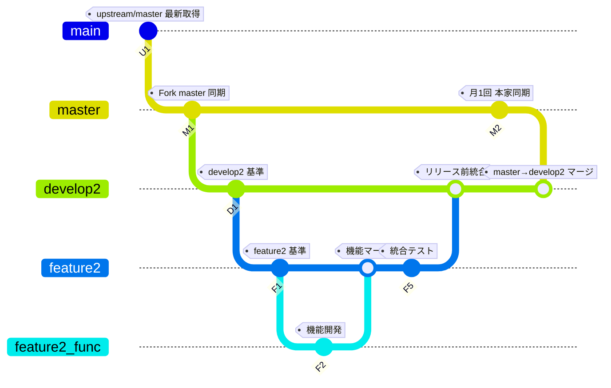

# Git ブランチ運用マニュアル

---

## 1. Git運用ステップ一覧

| ステップID | 内容                           | 作業内容説明                        | 備考                   |
|------------|------------------------------|---------------------------------|------------------------|
| U1         | 本家 (upstream/master) 最新取得 | 本家リポジトリの最新変更を取得し、Forkのmasterに反映する | 下記コマンド参照        |
| M1         | Fork master 更新              | Forkのmasterを最新状態に同期する    | 同上                   |
| D1         | develop2 基準コミット         | develop2ブランチにmasterの最新を反映する | 下記コマンド参照        |
| F1         | feature2 基準コミット         | 開発用のfeature2ブランチを最新に保つ | 下記コマンド参照        |
| F2〜F4     | 個別機能ブランチ(feature2_func) 開発 | 個別機能ブランチで開発・コミットを行う | 下記コマンド参照        |
| F5         | 個別機能ブランチをfeature2にマージ | 完了した機能ブランチをfeature2に統合 | 下記コマンド参照        |
| M2         | 月1回 master→develop2 マージ | 本家同期後、masterの変更をdevelop2に反映 | 下記コマンド参照        |

---

## 2. Gitコマンド例一覧

```bash
# U1, M1
git fetch upstream
git checkout master
git merge upstream/master
git push origin master

# D1
git checkout develop2
git merge master
git push origin develop2

# F1
git checkout feature2
git pull origin feature2

# F2〜F4
git checkout -b feature2_func
# （機能開発・コミット作業）

# F5
git checkout feature2
git merge feature2_func
git push origin feature2

# M2
git checkout develop2
git merge master
git push origin develop2

```

# Git運用ステップ＆コマンド

| ステップID | 内容                               | 作業内容説明                           | Gitコマンド例                                                    |
|------------|----------------------------------|------------------------------------|-----------------------------------------------------------------|
| U1         | 本家 (upstream/master) 最新取得   | 本家リポジトリの最新変更を取得し、Forkのmasterに反映する | ```bash<br>git fetch upstream<br>git checkout master<br>git merge upstream/master<br>git push origin master<br>``` |
| M1         | Fork master 更新                  | Forkのmasterを最新状態に同期する        | (U1と同じ)                                                      |
| D1         | develop2 基準コミット             | develop2ブランチにmasterの最新を反映する | ```bash<br>git checkout develop2<br>git merge master<br>git push origin develop2<br>```       |
| F1         | feature2 基準コミット             | 開発用のfeature2ブランチを最新に保つ     | ```bash<br>git checkout feature2<br>git pull origin feature2<br>```                          |
| F2-F4      | 個別機能ブランチ(feature2_func) 開発 | 個別機能ブランチで開発・コミットを行う   | ```bash<br>git checkout -b feature2_func<br># 開発・コミット作業<br>```                    |
| F5         | 個別機能ブランチをfeature2にマージ | 完了した機能ブランチをfeature2に統合     | ```bash<br>git checkout feature2<br>git merge feature2_func<br>git push origin feature2<br>``` |
| M2         | 月1回 master→develop2 マージ     | 本家同期後、masterの変更をdevelop2に反映 | ```bash<br>git checkout develop2<br>git merge master<br>git push origin develop2<br>```      |


