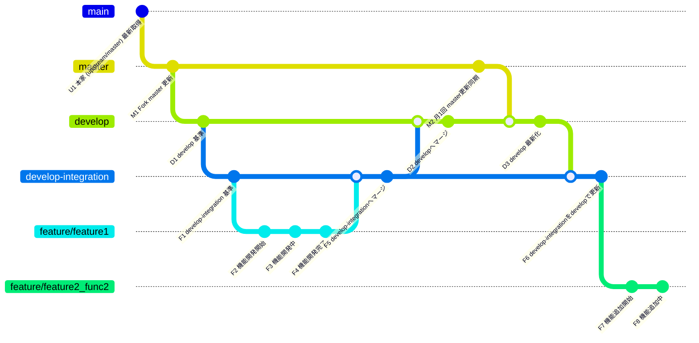

# Git ブランチ運用マニュアル  
GitHubを使用して、ローカルのVSCodeで開発を行います

Git環境はこちらです  
Fork元(upstream)： https://github.com/xbapps/xbvr.git  
Fork先： https://github.com/balckpixie/xbvr.git

使用するブランチの代表的なものはこちら  
- master  
- develop  
- develop-integration  
- feature/機能名（※開発する機能ごとに作成）

想定するブランチ運用はこちら  
- **master** は常に本家（upstream）の最新状態と同期される  
- **develop** は Fork元の最新master と develop-integration の安定版を統合するブランチ  
- **develop-integration** は複数featureを統合し動作検証を行う開発統合用ブランチ  
- 個別機能開発は新たに **feature/機能名** ブランチを作成して行う  
- 開発完了した feature/機能名 は develop-integration にマージされ動作検証を行う  
- 動作検証が完了したら develop-integration から develop へマージを行う  
- 1か月に1度、masterの更新差分を develop にマージする  
- **F6〜F8の流れ:**  
  - M2のmaster同期後、developは最新のdevelop-integrationを取り込み更新（F6）  
  - 新規機能開発は更新済みのdevelop-integrationから新規featureブランチを作成（F7〜F8）  

---

## ブランチ一覧と説明

| ブランチ名            | 役割・用途                                                                                  | 備考                                                     |
|-----------------------|---------------------------------------------------------------------------------------------|----------------------------------------------------------|
| master                | Forkリポジトリの安定版ブランチ。本家 (upstream/master) の内容を常に同期する                  | 本家から最新を取得（U1, M1）、開発環境に反映する         |
| develop               | Fork元master と develop-integration の安定版をマージする統合用ブランチ                       | master更新（M2）後に最新状態になる                       |
| develop-integration   | 複数のfeatureを統合し動作検証・調整を行う開発統合ブランチ                                   | featureブランチのマージ先。ここで動作確認後 developへマージ |
| feature/機能名        | 個別機能開発用ブランチ。develop-integration にマージし動作検証を行う                         | 開発単位ごとに作成                                        |

---

## フロー図

## 1. Git運用ステップ一覧

| ステップID | 内容                                | 作業内容説明                                                  | 備考                   |
|------------|------------------------------------|---------------------------------------------------------------|------------------------|
| U1         | 本家 (upstream/master) 最新取得     | 本家リポジトリの最新変更を取得し、Forkのmasterに反映する       | 下記コマンド参照        |
| M1         | Fork master 更新                   | Forkのmasterを最新状態に同期する                              | 同上                   |
| D1         | develop 基準コミット               | developブランチにmasterの最新を反映する                       | 下記コマンド参照        |
| F1         | develop-integration 基準コミット  | develop-integration ブランチを最新の develop に同期           | 下記コマンド参照        |
| F2〜F4     | 個別機能ブランチ(feature/xxx) 開発 | 個別機能ブランチで開発・コミットを行う                         | 下記コマンド参照        |
| F5         | 個別機能ブランチをdevelop-integrationにマージ | 完了した機能ブランチを develop-integration に統合             | 下記コマンド参照        |
| D2         | develop-integration から developへマージ | 開発完了し動作検証済みの内容を develop に反映                  | 下記コマンド参照        |
| M2         | 月1回 master→develop マージ       | 本家同期後、masterの変更を develop に反映                      | 下記コマンド参照        |
| F6         | M2後にdevelopを最新develop-integrationで更新 | develop-integrationの最新状態をdevelopに取り込み、基準を更新する | 下記コマンド参照        |
| F7〜F8     | M2後の新規機能ブランチ(feature/xxx) 開発 | develop-integrationを基準に新しい機能開発を行う               | 下記コマンド参照        |

---

## 2. Gitコマンド例一覧

```bash
# U1, M1
git fetch upstream
git checkout master
git merge upstream/master
git push origin master

# D1
git checkout develop
git merge master
git push origin develop

# F1
git checkout develop-integration
git merge develop
git push origin develop-integration

# F2〜F4
git checkout -b feature/機能名
# （機能開発・コミット作業）

# F5
git checkout develop-integration
git merge feature/機能名
git push origin develop-integration

# D2
git checkout develop
git merge develop-integration
git push origin develop

# M2
git checkout develop
git merge master
git push origin develop

# F6（M2後にdevelopを最新develop-integrationで更新）
git checkout develop-integration
git merge develop
git push origin develop-integration

# F7〜F8（新しい機能開発ブランチ作成）
git checkout -b feature/新機能名
# （新規機能開発・コミット作業）
