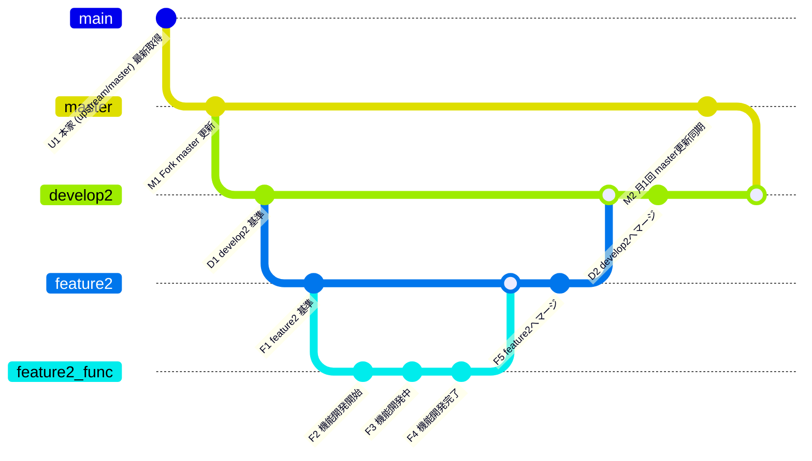

# Git ブランチ運用マニュアル
GitHubを使用して、ローカルのVSCodeで開発を行います

Git環境はこちらです
Fork元(upstream)： https://github.com/xbapps/xbvr.git
Fork先： https://github.com/balckpixie/xbvr.git

使用するブランチの代表的なものはこちら
  master
  develop2
  feature2
  feature2_機能名（※開発する機能ごとに作成）

想定するブランチ運用はこちら
・masterは常に本家（upstream）の最新状態と同期される
・リリース用の最新ソースは develop2で管理する。基本的にdevelop2で機能開発は行わず、リリースビルド用の環境とする
・開発中のソースはfeature2で管理し、コード変更はこのブランチを使用
・個別機能開発はあらたなブランチfeature2_機能名 を作成して開発を行う
・Feature2_機能名で開発が完了したものはfeature2へマージされ、リリース前の評価はfeature2で行う
・開発が完了したものは、feature2からdevelop2へマージを行う
・１か月に１度の頻度で、masterの更新差分を develop2へマージを行う

依頼事項として
・ブランチの関係図を作成してください。できるだけグラフィカルに視覚的にわかりやすい形で
・それぞれの運用ステップを整理して、各ステップにおける作業内容とコマンドを作成してください

---

# Git ブランチ運用マニュアル

---
## ブランチ一覧と説明

| ブランチ名       | 役割・用途                                                                 | 備考                                                                 |
|------------------|----------------------------------------------------------------------------|----------------------------------------------------------------------|
| master           | Forkリポジトリの安定版ブランチ。本家 (upstream/master) の内容を月1回同期する | 本家から最新を取得（U1, M1）、開発環境に反映（M2）                   |
| develop2         | 開発統合用ブランチ。すべてのfeatureブランチはこのブランチを基準に作成する     | master更新（M2）後に最新状態になる。feature2からのマージ先（D2）     |
| feature2         | 中規模〜大規模機能開発の基礎ブランチ。複数の機能ブランチをまとめる           | M2後にはdevelop2の最新を取り込み（F6）してから開発を続ける           |
| feature2_func    | feature2を基準にした個別機能ブランチ（1回目の機能追加）                     | 開発完了後にfeature2へマージ（F5）                                   |
| feature2_func2   | feature2を基準にした個別機能ブランチ（M2後の新規機能追加）                   | F6で最新化されたfeature2を基準に作成。開発後は同様にfeature2へマージ |

---

## 1. Git運用ステップ一覧

| ステップID | 内容                           | 作業内容説明                        | 備考                   |
|------------|------------------------------|---------------------------------|------------------------|
| U1         | 本家 (upstream/master) 最新取得 | 本家リポジトリの最新変更を取得し、Forkのmasterに反映する | 下記コマンド参照        |
| M1         | Fork master 更新              | Forkのmasterを最新状態に同期する    | 同上                   |
| D1         | develop2 基準コミット         | develop2ブランチにmasterの最新を反映する | 下記コマンド参照        |
| F1         | feature2 基準コミット         | 開発用のfeature2ブランチを最新に保つ | 下記コマンド参照        |
| F2〜F4     | 個別機能ブランチ(feature2_func) 開発 | 個別機能ブランチで開発・コミットを行う | 下記コマンド参照        |
| F5         | 個別機能ブランチをfeature2にマージ | 完了した機能ブランチをfeature2に統合 | 下記コマンド参照        |
| D2         | feature2からdevelop2へマージ  | 開発完了したfeature2の内容をdevelop2に反映 | 下記コマンド参照        |
| M2         | 月1回 master→develop2 マージ | 本家同期後、masterの変更をdevelop2に反映 | 下記コマンド参照        |

---

## 2. Gitコマンド例一覧

```bash
# U1, M1
git fetch upstream
git checkout master
git merge upstream/master
git push origin master

# D1
git checkout develop2
git merge master
git push origin develop2

# F1
git checkout feature2
git pull origin feature2

# F2〜F4
git checkout -b feature2_func
# （機能開発・コミット作業）

# F5
git checkout feature2
git merge feature2_func
git push origin feature2

# D2
git checkout develop2
git merge feature2
git push origin develop2

# M2
git checkout develop2
git merge master
git push origin develop2

```

# 継続開発するフロー
## 1. Git運用ステップ一覧（修正版）

| ステップID | 内容                                             | 作業内容説明                                              | 備考                   |
|------------|--------------------------------------------------|-----------------------------------------------------------|------------------------|
| U1         | 本家 (upstream/master) 最新取得                   | 本家リポジトリの最新変更を取得し、Forkのmasterに反映する   | 下記コマンド参照        |
| M1         | Fork master 更新                                 | Forkのmasterを最新状態に同期する                          | 同上                   |
| D1         | develop2 基準コミット                            | develop2ブランチにmasterの最新を反映する                   | 下記コマンド参照        |
| F1         | feature2 基準コミット                            | 開発用のfeature2ブランチを最新に保つ                       | 下記コマンド参照        |
| F2〜F4     | 個別機能ブランチ(feature2_func) 開発              | 個別機能ブランチで開発・コミットを行う                     | 下記コマンド参照        |
| F5         | 個別機能ブランチをfeature2にマージ                | 完了した機能ブランチをfeature2に統合                       | 下記コマンド参照        |
| D2         | feature2からdevelop2へマージ                     | 開発完了したfeature2の内容をdevelop2に反映                 | 下記コマンド参照        |
| M2         | 月1回 master→develop2 マージ                     | 本家同期後、masterの変更をdevelop2に反映                   | 下記コマンド参照        |
| F6         | M2後にfeature2を最新develop2で更新                | develop2の最新状態をfeature2に取り込み、基準を更新する     | 下記コマンド参照        |
| F7〜F8     | M2後の新規機能ブランチ(feature2_func2) 開発       | 更新後のfeature2を基準に新しい機能開発を行う               | 下記コマンド参照        |

---

## 2. Gitコマンド例一覧（修正版）

```bash
# U1, M1
git fetch upstream
git checkout master
git merge upstream/master
git push origin master

# D1
git checkout develop2
git merge master
git push origin develop2

# F1
git checkout feature2
git pull origin feature2

# F2〜F4
git checkout -b feature2_func
# （機能開発・コミット作業）

# F5
git checkout feature2
git merge feature2_func
git push origin feature2

# D2
git checkout develop2
git merge feature2
git push origin develop2

# M2
git checkout develop2
git merge master
git push origin develop2

# F6（M2後にfeature2を最新develop2で更新）
git checkout feature2
git merge develop2
git push origin feature2

# F7〜F8（新しい機能開発ブランチ作成）
git checkout -b feature2_func2
# （新規機能開発・コミット作業）

```
```mermaid
gitGraph
  commit id: "U1 本家 (upstream/master) 最新取得"
  branch master
  checkout master
  commit id: "M1 Fork master 更新"
  branch develop2
  checkout develop2
  commit id: "D1 develop2 基準"
  branch feature2
  checkout feature2
  commit id: "F1 feature2 基準"
  branch feature2_func
  checkout feature2_func
  commit id: "F2 機能開発開始"
  commit id: "F3 機能開発中"
  commit id: "F4 機能開発完了"
  checkout feature2
  merge feature2_func
  commit id: "F5 feature2へマージ"
  checkout develop2
  merge feature2
  commit id: "D2 develop2へマージ"
  checkout master
  commit id: "M2 月1回 master更新同期"
  checkout develop2
  merge master
  commit id: "D3 develop2 最新化"


  checkout feature2
  merge develop2
  commit id: "F6 feature2をdevelop2で更新"
  branch feature2_func2
  checkout feature2_func2
  commit id: "F7 機能追加開始"
  commit id: "F8 機能追加中"
